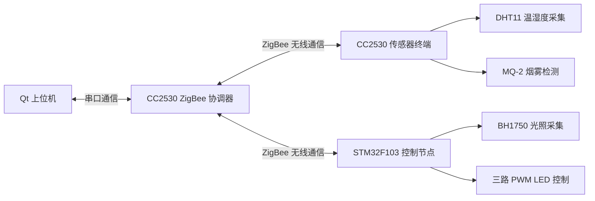

# ZigBee SmartHome System

一个基于 **ZigBee + STM32 + Qt** 的智能家居环境监测与控制系统。

本项目由 **Qt 上位机、CC2530 ZigBee 协调器、CC2530 终端节点、STM32F103 控制节点** 组成，实现了环境数据采集、ZigBee 无线通信、灯光控制、上位机数据显示与控制命令下发等功能。

> 本项目为个人毕业设计实物项目，已完成系统联调与演示。

---

## 项目标签

`STM32` `CC2530` `ZigBee` `Qt` `QtCharts` `UART` `PWM` `Sensor` `Smart Home`

---

## 1. 项目简介

本系统面向智能家居环境监测与控制场景，主要完成环境数据采集、无线数据传输、上位机显示以及灯光控制等功能。

系统主要实现内容包括：

* 温湿度数据采集
* 烟雾浓度数据采集
* 光照强度数据采集
* 三路 PWM 灯光控制
* ZigBee 终端节点与协调器之间的数据传输
* 协调器与 Qt 上位机之间的串口通信
* Qt 上位机实时数据显示、曲线绘制和设备状态显示
* Qt 上位机下发控制命令，实现对下位机设备的控制

项目整体采用多节点架构：

| 模块                | 功能                        |
| ----------------- | ------------------------- |
| Qt 上位机            | 数据显示、曲线绘制、设备状态显示、控制命令下发   |
| CC2530 ZigBee 协调器 | ZigBee 网络建立、终端数据接收、串口转发   |
| CC2530 传感器终端      | 温湿度、烟雾等环境数据采集与无线发送        |
| STM32F103 控制节点    | 光照采集、三路 PWM LED 控制、控制命令执行 |

---

## 2. 系统架构



系统数据流如下：

```text
传感器节点采集数据
        ↓
ZigBee 终端节点发送数据
        ↓
CC2530 协调器接收并转发
        ↓
Qt 上位机通过串口解析数据
        ↓
界面显示数值、曲线和设备状态
```

控制流如下：

```text
Qt 上位机下发控制命令
        ↓
CC2530 协调器通过 ZigBee 转发
        ↓
STM32F103 控制节点接收命令
        ↓
执行 PWM 灯光控制
```

---

## 3. 硬件组成

| 硬件模块            | 说明                        |
| --------------- | ------------------------- |
| Orange Pi Zero2 | Qt 上位机运行平台                |
| CC2530 协调器      | ZigBee 网络建立、终端节点通信、串口数据转发 |
| CC2530 终端节点     | 温湿度、烟雾等环境数据采集             |
| STM32F103 控制节点  | 光照采集、PWM 灯光控制             |
| DHT11           | 温湿度传感器                    |
| MQ-2            | 烟雾传感器                     |
| BH1750          | 光照强度传感器                   |
| LED / PWM 输出    | 灯光亮度控制                    |

---

## 4. 软件模块

### 4.1 Qt 上位机

Qt 上位机主要负责系统的人机交互和数据可视化显示。

主要功能包括：

* 串口数据接收
* 自定义通信协议解析
* 温湿度数据显示
* 烟雾状态数据显示
* 光照强度数据显示
* 曲线绘制
* 设备状态显示
* 按钮控制
* 控制命令打包并下发

对应目录：

```text
qt_upper_computer/
```

---

### 4.2 CC2530 ZigBee 协调器

CC2530 协调器作为 ZigBee 网络中心节点，主要负责终端节点入网、数据接收和数据转发。

主要功能包括：

* ZigBee 网络建立
* 终端节点入网管理
* 接收终端节点上传的数据
* 通过串口将数据转发给 Qt 上位机
* 接收 Qt 上位机下发的控制命令
* 将控制命令转发给对应终端节点

对应目录：

```text
cc2530_coordinator/
```

---

### 4.3 CC2530 传感器终端

CC2530 传感器终端主要负责环境数据采集和 ZigBee 无线发送。

主要功能包括：

* DHT11 温湿度数据采集
* MQ-2 烟雾数据采集
* 传感器数据打包
* 通过 ZigBee 上传数据至协调器

对应目录：

```text
cc2530_terminal/sensor_node/
```

---

### 4.4 ZigBee 控制通信节点

ZigBee 控制通信节点主要负责协调器与 STM32F103 控制节点之间的数据交互。

主要功能包括：

* 接收协调器转发的控制命令
* 将控制命令传递给 STM32F103 控制节点
* 配合 STM32F103 完成光照数据上传与灯光控制
* 实现系统中控制链路的无线通信部分

对应目录：

```text
cc2530_terminal/light_node/
```

在本系统中，CC2530 主要负责 ZigBee 无线通信，STM32F103 主要负责具体的传感器采集与 PWM 控制执行。

---

### 4.5 STM32F103 控制节点

STM32F103 控制节点主要负责光照采集和 LED 灯光控制。

主要功能包括：

* BH1750 光照强度采集
* 三路 PWM LED 输出
* 接收 ZigBee 控制命令
* 支持手动控制模式
* 支持自动控制模式
* 根据环境光照和上位机命令执行灯光控制策略

对应目录：

```text
stm32_node/
```

---

## 5. 仓库目录说明

```text
ZigBee-SmartHome-System/
├── cc2530_coordinator/      # CC2530 ZigBee 协调器工程
├── cc2530_terminal/         # CC2530 ZigBee 终端节点工程
│   ├── light_node/          # ZigBee 控制通信节点
│   └── sensor_node/         # 温湿度 / 烟雾采集终端节点
├── qt_upper_computer/       # Qt 上位机工程
├── stm32_node/              # STM32F103 控制节点工程
├── .gitignore               # Git 忽略规则
└── README.md                # 项目说明文档
```

---

## 6. 通信协议说明

本项目使用自定义数据帧完成不同模块之间的数据交互，主要包括传感器数据上报、光照数据上报和控制命令下发。

### 6.1 通信链路

系统中主要存在两条通信链路：

```text
CC2530 终端节点  <-- ZigBee -->  CC2530 协调器
```

```text
CC2530 协调器  <-- UART -->  Qt 上位机
```

其中：

* ZigBee 负责终端节点与协调器之间的无线通信
* UART 负责协调器与 Qt 上位机之间的数据交互

---

### 6.2 数据帧设计思路

协议设计主要考虑以下几点：

* 使用固定帧头标识一帧数据的开始
* 使用命令字区分不同类型的数据或控制命令
* 使用数据长度字段提高解析灵活性
* 使用数据区存放传感器数据、设备状态或控制参数
* 上位机采用数据缓存和滑动解析方式，降低串口粘包、半包对解析的影响

典型数据帧结构如下：

```text
帧头 + 命令字 + 数据长度 + 数据内容 + 校验/结束标志
```

不同命令字对应不同功能：

| 命令类型    | 功能说明                |
| ------- | ------------------- |
| 传感器数据上报 | 上传温度、湿度、烟雾等环境数据     |
| 光照数据上报  | 上传当前光照强度和灯光状态       |
| 控制命令下发  | 控制 LED 工作模式和 PWM 亮度 |
| 状态信息反馈  | 返回设备当前运行状态          |

---

### 6.3 传感器数据上报

传感器节点周期性采集环境数据，并通过 ZigBee 上传至协调器，再由协调器通过串口发送给 Qt 上位机。

数据内容主要包括：

* 温度
* 湿度
* 烟雾数字量状态
* 烟雾模拟量数据
* 报警状态位

---

### 6.4 光照数据上报

STM32F103 控制节点采集 BH1750 光照强度数据，并上传至 Qt 上位机显示当前环境亮度。

数据内容主要包括：

* 光照强度
* 当前灯光状态
* 当前控制模式

---

### 6.5 控制命令下发

Qt 上位机可下发控制命令，用于控制 LED 工作模式和亮度输出。

控制模式包括：

* 手动控制
* 自动控制
* 报警联动控制

---

## 7. 已实现功能

* [x] CC2530 ZigBee 协调器组网
* [x] CC2530 终端节点数据上传
* [x] DHT11 温湿度数据采集
* [x] MQ-2 烟雾数据采集
* [x] STM32F103 光照采集
* [x] STM32F103 三路 PWM LED 控制
* [x] Qt 串口通信
* [x] Qt 数据解析与显示
* [x] Qt 曲线绘制
* [x] 上位机控制命令下发
* [x] 多节点系统实物联调
* [x] 毕业设计演示

---

## 8. 项目特点

* 采用多节点系统架构，包含上位机、协调器、传感器终端和控制节点
* 使用 ZigBee 完成无线数据传输
* 使用 Qt 实现可视化上位机界面
* 使用 STM32F103 实现光照采集与 PWM 灯光控制
* 使用 CC2530 实现 ZigBee 协调器和终端节点通信
* 使用自定义通信协议完成数据解析与命令控制
* 完成了从底层采集、无线通信、协议解析到上位机显示控制的完整闭环

---

## 9. 开发环境

| 模块               | 开发环境                         |
| ---------------- | ---------------------------- |
| Qt 上位机           | Qt 5 / Qt Creator / QtCharts |
| STM32F103 控制节点   | Keil MDK                     |
| CC2530 ZigBee 节点 | IAR Embedded Workbench       |
| Linux 运行平台       | Orange Pi Zero2              |
| 通信调试             | 串口调试助手 / USB-TTL             |

说明：

* Qt 上位机运行在 Orange Pi Zero2 平台上
* CC2530 工程用于 ZigBee 协调器和终端节点开发
* STM32F103 工程用于光照采集、PWM 输出和控制逻辑执行

---

## 10. 运行说明

### 10.1 CC2530 协调器

打开 `cc2530_coordinator/` 目录下的工程，编译并下载到 CC2530 协调器节点。

协调器主要负责：

* 建立 ZigBee 网络
* 接收终端节点数据
* 通过串口转发数据到 Qt 上位机
* 接收上位机命令并转发给终端节点

---

### 10.2 CC2530 终端节点

打开 `cc2530_terminal/` 目录下对应的终端工程，编译并下载到 CC2530 终端节点。

终端节点主要负责：

* 采集传感器数据
* 打包数据帧
* 通过 ZigBee 上传至协调器

---

### 10.3 STM32F103 控制节点

打开 `stm32_node/` 目录下的 STM32 工程，编译并下载到 STM32F103 控制板。

STM32F103 控制节点主要负责：

* BH1750 光照强度采集
* 三路 PWM LED 输出
* 接收控制命令
* 根据手动 / 自动模式执行灯光控制策略

---

### 10.4 Qt 上位机

打开 `qt_upper_computer/` 目录下的 Qt 工程，编译并运行上位机程序。

Qt 上位机主要负责：

* 打开串口
* 接收协调器上传的数据
* 解析自定义通信协议
* 显示实时数据、曲线和设备状态
* 下发灯光控制命令

---

## 11. 项目状态

当前项目已完成完整功能闭环：

```text
传感器采集
    ↓
ZigBee 通信
    ↓
协调器转发
    ↓
Qt 上位机显示
    ↓
控制命令下发
    ↓
STM32F103 执行控制
```

该项目已用于毕业设计实物演示。

---

## 12. 项目截图

### 12.1 Qt 上位机界面

> 后续可补充 Qt 上位机运行界面截图。

### 12.2 实物连接效果

> 后续可补充 CC2530、STM32F103、传感器和 Orange Pi Zero2 的实物连接图片。

### 12.3 数据曲线显示

> 后续可补充温湿度、烟雾、光照等数据曲线显示效果。

---

## 13. 后续可优化方向

* 优化 Qt 上位机界面风格
* 增加更多设备控制节点
* 增加数据本地存储功能
* 增加历史曲线查询功能
* 增加异常报警日志
* 优化通信协议可靠性
* 增加设备在线状态检测
* 增加设备参数配置功能

---

## 14. 技术栈

| 类型        | 技术                    |
| --------- | --------------------- |
| 上位机       | Qt / C++ / QtCharts   |
| Linux 平台  | Orange Pi Zero2       |
| 主控芯片      | STM32F103             |
| ZigBee 芯片 | CC2530                |
| 通信方式      | ZigBee / UART         |
| 传感器       | DHT11 / MQ-2 / BH1750 |
| 控制方式      | PWM                   |
| 开发语言      | C / C++               |

---

## 15. 项目收获

通过本项目，完成了一个从嵌入式节点采集、ZigBee 无线通信、串口协议解析到 Qt 上位机显示控制的完整系统闭环。

项目过程中主要完成了以下能力训练：

* 熟悉了 CC2530 ZigBee 协调器与终端节点的基本开发流程
* 掌握了 STM32F103 传感器采集、PWM 输出和串口通信的基本应用
* 理解了多节点系统中数据上报和命令下发的整体链路
* 使用 Qt 完成了上位机界面设计、串口通信和曲线显示
* 设计并实现了简单的自定义通信协议
* 完成了多模块之间的联调、测试和问题排查

该项目重点锻炼了嵌入式系统集成、通信协议设计、上位机开发和软硬件联调能力。

---

## 16. 开源说明

本项目为个人毕业设计实物项目，主要用于学习交流和项目展示。

仓库中代码和文档仅供参考，不建议直接用于实际产品环境。

如需复现本项目，需要根据实际硬件连接、传感器型号、串口参数和 ZigBee 节点配置进行适配。

---

## 17. License

本项目仅用于学习交流，代码可在保留原作者信息的前提下参考使用。
